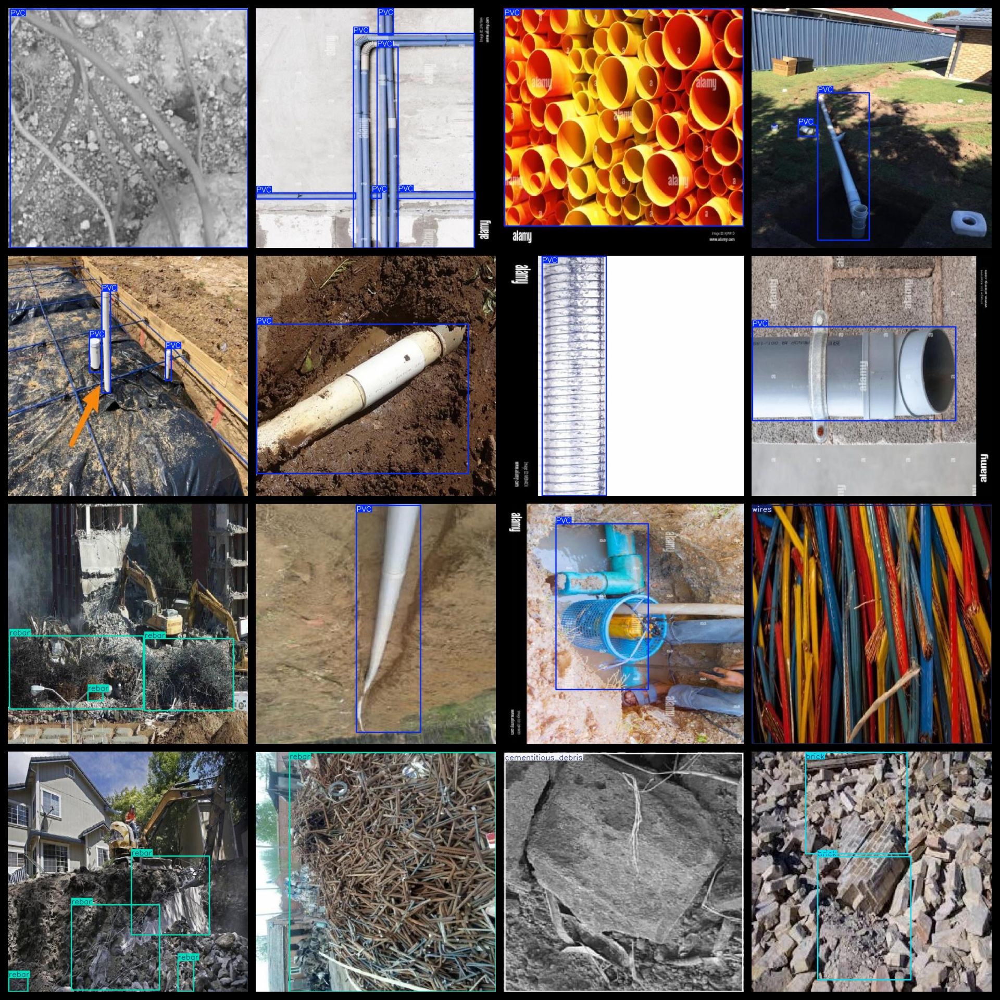
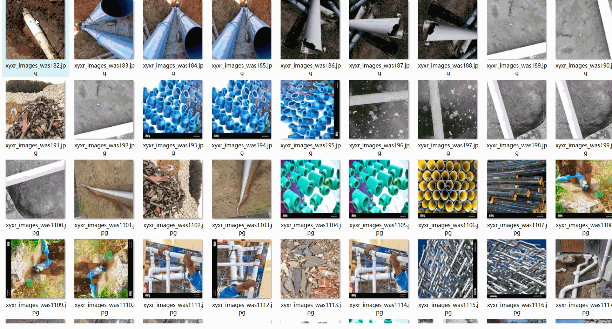

# Building SCRAPS Detection Dataset 1761 imagesVOC+YOLO format

Construction Waste Detection Dataset 1761 sheets VOC + YOLO format

Dataset format: Pascal VOC format + YOLO format (the txt file does not contain the split path, it only contains jpg images and corresponding VOC format xml files and yolo format txt files)

Number of images (number of jpg files): 1761

Number of xml files: 1761

Number of txt files: 1761

Number of callout categories: 5

The Github repository is: datasets_sl

["PVC", "brick", "cementitious_debris", "rebar", "wires"]

Label P Chinese Translation: PVC (Polyvinyl Chloride)", "Brick", "Crushed Cement", "Rebar", "Wire

Number of boxes labeled in each category:

PVC frame count = 1564

Brick Frame Count = 723

The number of frames in the "cementitious_debris" frame is 279.

The number of rebar bars is 2165.

Wires frame count = 276

Total number of frames: 5007

Number of images per category:

PVC occupies picture counts = 552

Bricks have 326 images.

Cementitious_debris occupies a total of 156 pictures.

Rebar occupies 479 images.

Wires occupies the number of images = 250

Image resolution: 640x640

Use the labeling tool: labelImg

Dataset Augmentation: Yes

Rules for annotation: Draw a rectangle around the category.

Important note: The dataset does not have been divided into training, validation, and testing sets.

Special Disclaimer: This dataset does not guarantee the accuracy of the trained models or weight files.

Annotation and image details are as follows:

## Images

---

Here is a pay link on Stripe (https://buy.stripe.com/3cs8yP7sY87d0vu9AB). Please contact me lonlonago@foxmail.com after funding $89, and I will send you a complete data files, thank you!

